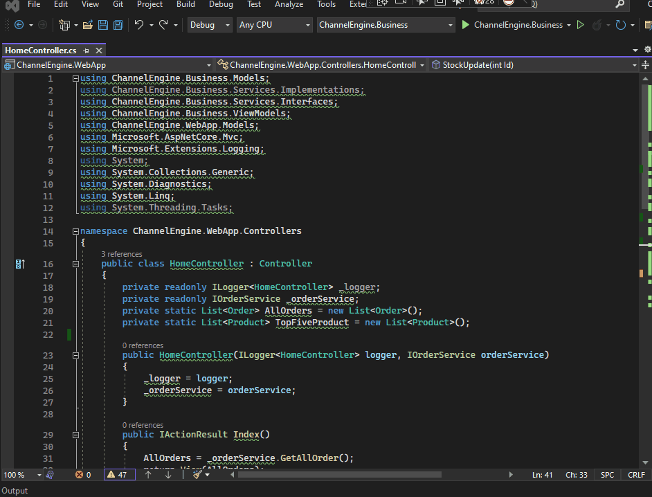

# CXCommenter: A Visual Studio Extension for Automatic XML Commenting

CXCommenter is a Free Visual Studio extension written in C# that aims to make code commenting easier and more efficient. 
With CXCommenter, you can quickly and easily create well-formatted comments that provide better context and documentation for your code.

# Installation
To install CXCommenter, follow these steps:

    1.  Clone the CXCommenter repository to your local machine
    2.  Open the CXCommenter.sln solution file in Visual Studio
    3.  Build the solution
    4.  Double-click the CXCommenter.vsix file in the bin/Debug or bin/Release folder to install the extension
    5.  Restart Visual Studio

# Usage
Once installed, CXCommenter can be accessed from the Visual Studio menu under "Edit > Generate Comment". 

# Features
CXCommenter includes the following features:

Supports all major comment types, including summary comments, parameter comments, and return comments
Provides a customizable comment template that can be modified to match your team's coding standards
Includes IntelliSense support to quickly generate comments based on your code
Integrates with Visual Studio's code editor for a seamless commenting experience

